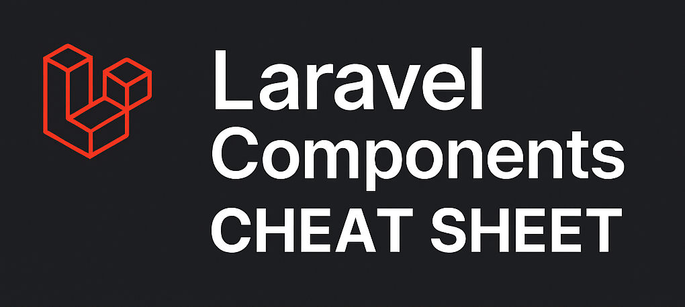

# Laravel Components Cheat Sheet

> **Riferimento rapido** per le componentistiche principali di Laravel e le best practices per utilizzarle correttamente

<!-- Open Graph Meta Tags -->
<meta property="og:title" content="Laravel Components Cheat Sheet">
<meta property="og:description" content="Riferimento rapido per le componentistiche principali di Laravel e le best practices per utilizzarle correttamente">
<meta property="og:image" content="https://raw.githubusercontent.com/FabioGuin/Laravel-Components-CheatSheet/main/assets/hero-image.png">
<meta property="og:image:width" content="1020">
<meta property="og:image:height" content="458">
<meta property="og:image:alt" content="Laravel Components Cheat Sheet - Guida completa alle componentistiche Laravel">
<meta property="og:type" content="website">
<meta property="og:url" content="https://github.com/FabioGuin/Laravel-Components-CheatSheet">

<!-- Twitter Card Meta Tags -->
<meta name="twitter:card" content="summary_large_image">
<meta name="twitter:title" content="Laravel Components Cheat Sheet">
<meta name="twitter:description" content="Riferimento rapido per le componentistiche principali di Laravel e le best practices per utilizzarle correttamente">
<meta name="twitter:image" content="https://raw.githubusercontent.com/FabioGuin/Laravel-Components-CheatSheet/main/assets/hero-image.png">
<meta name="twitter:image:alt" content="Laravel Components Cheat Sheet - Guida completa alle componentistiche Laravel">

<div align="center">
  
</div>

[](https://laravel.com)
[](https://php.net)
[](LICENSE)

## Panoramica

Questo cheat sheet fornisce una guida completa e pratica per le componentistiche principali di Laravel, con focus sulle **best practices** per utilizzarle correttamente.

## Obiettivo

- **Riferimento rapido** per sviluppatori Laravel
- **Best Practices** per ogni componentistica
- **Esempi pratici** di codice corretto e sbagliato
- **Pattern alternativi** per ogni anti-pattern
- **Service Layer** come core logico dell'applicazione

## Contenuto

### 18 Componentistiche Principali

1. **Service Container** - IoC e dependency injection
2. **Service Provider** - configurazione per la IoC
3. **Service** - implementazione logica business
4. **Repository** - astrazione accesso dati
5. **Model** - rappresentazione entità database
6. **Controller** - gestione richieste HTTP
7. **Middleware** - filtri cross-cutting
8. **Form Request** - validazione centralizzata
9. **Resource** - trasformazione per API
10. **Event & Listener** - decoupling e comunicazione
11. **Job** - elaborazione asincrona
12. **Policy** - autorizzazione granulare
13. **Blade Templates** - sistema templating
14. **Artisan Commands** - comandi CLI
15. **Migration** - versionamento database
16. **Seeder** - popolamento dati
17. **Factory** - generazione dati test
18. **Test** - verifica comportamento

### Sezioni Speciali

- **Il Service Layer: Il Core Logico** - Approfondimento sul ruolo centrale del Service
- **Best Practices Generali** - Principi SOLID, DRY, KISS, YAGNI
- **Quick Reference** - Flusso tipico e pattern di utilizzo

## Come Usare

1. **Consulta** il [Laravel Components Cheat Sheet](LARAVEL-COMPONENTS-CHEAT-SHEET.md)
2. **Segui** le best practices per ogni componentistica
3. **Applica** i pattern alternativi per evitare anti-pattern
4. **Usa** il Service Layer come core logico dell'applicazione

## Struttura

```
Laravel-Components-CheatSheet/
├── README.md                           # Questo file
├── LARAVEL-COMPONENTS-CHEAT-SHEET.md  # Cheat sheet principale
├── LICENSE                             # Licenza Apache 2.0
├── assets/                             # Risorse grafiche
│   └── hero-image.png                  # Immagine HERO
└── .gitignore                          # File da ignorare
```

## Caratteristiche

- ✅ **Best Practices** per ogni componentistica
- ✅ **Esempi pratici** di codice corretto e sbagliato
- ✅ **Pattern alternativi** per ogni anti-pattern
- ✅ **Approfondimento** sul Service Layer
- ✅ **Quick reference** per consultazione rapida
- ✅ **Formattazione** chiara e leggibile

## Link Utili

- [Laravel Documentation](https://laravel.com/docs)
- [Laravel Best Practices](https://laravel.com/docs/best-practices)
- [Laravel Service Container](https://laravel.com/docs/container)
- [Laravel Service Providers](https://laravel.com/docs/providers)

## Contribuire

Le contribuzioni sono benvenute! Se vuoi migliorare questo cheat sheet:

1. **Fork** del repository
2. **Crea** un branch per la tua feature
3. **Modifica** il contenuto
4. **Crea** una Pull Request

## Licenza

Questo progetto è rilasciato sotto licenza Apache 2.0. Vedi il file [LICENSE](LICENSE) per i dettagli.

## Autore

Creato per la community Laravel italiana.

---

**Nota**: Questo cheat sheet è complementare al progetto [Common Design Patterns](https://github.com/FabioGuin/common-design-patterns) che si concentra sui pattern di design applicati a Laravel.
